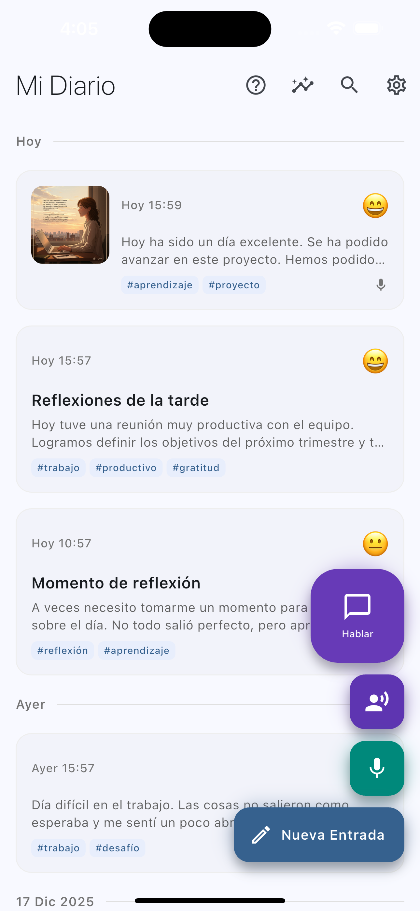
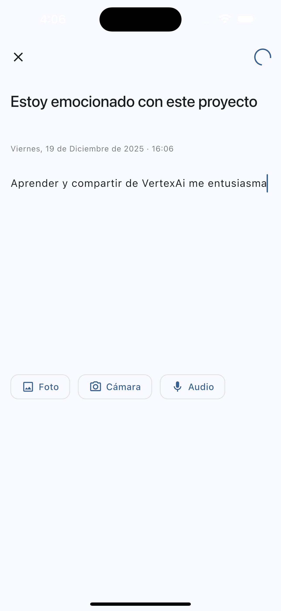

<div align="center">
  <a href="README.md">
    
  </a>
</div>

# 🌟 VoiceFlow Diary

<div align="center">


**Una aplicación de diario inteligente impulsada por IA de voz** 🎙️✨

Transforma tus pensamientos en hermosas entradas de diario usando el poder de Gemini AI de Google con capacidades de conversación de voz en tiempo real.

[Características](#-características) • [Demo](#-demo) • [Instalación](#-instalación) • [Arquitectura](#-arquitectura) • [Documentación](#-documentación)

</div>

---

## 📖 Resumen

**VoiceFlow Diary** es una aplicación de diario de nueva generación que combina el clásico registro de diario con tecnología de voz de IA de vanguardia. Construida con Flutter y potenciada por Firebase Vertex AI (Gemini), ofrece múltiples formas de capturar tus momentos diarios, desde escritura tradicional hasta conversaciones de voz manos libres.

### 📱 Galería de la App

<div align="center">
  <table>
    <tr>
      <td></td>
      <td></td>
      <td></td>
    </tr>
    <tr>
      <td align="center"><b>Inicio y Cronología</b></td>
      <td align="center"><b>Grabación de Voz</b></td>
      <td align="center"><b>Comandos IA</b></td>
    </tr>
    <tr>
      <td></td>
      <td></td>
      <td></td>
    </tr>
    <tr>
      <td align="center"><b>Crear Entrada</b></td>
      <td align="center"><b>Cambio de color por IA</b></td>
      <td align="center"><b>Imágenes Generadas por IA</b></td>
    </tr>
  </table>
</div>

### 🎯 ¿Qué la Hace Especial?

- 🎤 **Conversaciones de Voz en Tiempo Real**: Habla naturalmente con Gemini Live para una creación de diario instantánea y fluida
- 🗣️ **Comandos de Voz Tradicionales**: Graba, transcribe y procesa comandos de voz paso a paso
- 🎨 **Temas Dinámicos Impulsados por IA**: Cambia la apariencia de tu app simplemente preguntando
- 🖼️ **Generación Automática de Imágenes**: La IA crea hermosas ilustraciones para tus entradas
- 📊 **Resúmenes Inteligentes**: Obtén insights generados por IA sobre tus reflexiones diarias, semanales o mensuales
- 🌐 **Multiplataforma**: Funciona perfectamente en iOS, Android, Web, Windows, macOS y Linux

---

## ✨ Características

### 🎙️ Modos de Interacción por Voz

VoiceFlow Diary ofrece **tres modos distintos de interacción por voz** para máxima flexibilidad:

#### 1. 🔮 Asistente Gemini Live (Conversación en Tiempo Real)
- **Audio bidireccional en streaming** con Gemini 2.0 Flash Live
- **Latencia submilisegundo** para conversaciones naturales
- **Diálogo continuo** sin necesidad de iniciar/detener manualmente
- **Llamadas a funciones** durante la conversación para ejecutar acciones
- Comandos disponibles:
  - 🎨 Cambiar tema/color de la app
  - ❓ Hacer cualquier pregunta
  - 📝 Obtener resúmenes del diario
  - 🗑️ Eliminar entradas (con confirmación)

#### 2. 🎤 Asistente de Voz Tradicional
- Flujo de trabajo **Grabar → Transcribir → Procesar → Responder**
- **Retroalimentación basada en texto** vía SnackBars
- **Control explícito** sobre las sesiones de grabación
- Mismas capacidades de comando que el modo Live
- Ideal para **interacciones lentas y deliberadas**

#### 3. 🎙️ Creación de Notas de Voz
- **Creación rápida de entradas** de diario por voz
- **Transcripción automática** usando Gemini
- **Análisis de contenido impulsado por IA** con:
  - Detección de emociones
  - Extracción de temas clave
  - Etiquetado automático
- **Generación opcional de imágenes** con Imagen 3.0
- Perfecto para **capturar momentos sobre la marcha**

### 🤖 Capacidades de IA

#### Análisis de Contenido
- **Análisis de Sentimiento**: Detecta emociones (alegría, tristeza, emoción, etc.)
- **Extracción de Temas**: Identifica tópicos y temas principales
- **Etiquetado Inteligente**: Categoriza automáticamente las entradas
- **Generación de Títulos**: Crea títulos atractivos a partir del contenido

#### Generación de Imágenes
- **Integración con Imagen 3.0**: Genera hermosas ilustraciones
- **Consciente del Contexto**: Las imágenes coinciden con el estado de ánimo y contenido de tu entrada
- **Alta Calidad**: Obras de arte de aspecto profesional para cada entrada

#### IA Conversacional
- **Comprensión del Lenguaje Natural**: Gemini entiende contexto y matices
- **Conversaciones Multi-Turno**: Mantiene el contexto a través de intercambios
- **Soporte de Voz en Español**: Síntesis de voz nativa en español (Achernar)
- **Llamadas a Funciones**: Ejecuta acciones durante conversaciones

### 💾 Gestión de Datos

- **Almacenamiento Local SQLite**: Todos tus datos permanecen en tu dispositivo
- **Recuperación Rápida**: Consultas de base de datos optimizadas
- **Soporte de Medios Enriquecidos**: Almacena texto, imágenes y metadatos
- **Organización Basada en Fechas**: Entradas agrupadas por día/semana/mes

### 🎨 Interfaz de Usuario

- **Material Design 3**: Interfaz moderna y limpia
- **Temas Dinámicos**: Los colores de la app cambian según tus preferencias
- **Animaciones Suaves**: Interacciones pulidas en toda la app
- **Diseño Responsivo**: Se adapta a cualquier tamaño de pantalla
- **Retroalimentación Visual**: Indicadores claros para todas las acciones

---

## 🎬 Demo

### Comparación de Interacción por Voz

| Característica | Gemini Live | Tradicional | Nota de Voz |
|----------------|-------------|-------------|-------------|
| **Latencia** | <1 segundo | 3-5 segundos | 2-4 segundos |
| **Interacción** | Continua | Iniciar/Detener | Disparo único |
| **Tipo de Respuesta** | Voz | Texto | Entrada procesada |
| **Mejor Para** | Chat natural | Comandos deliberados | Captura rápida |
| **Uso de Red** | Mayor | Medio | Medio |

### Capturas de Pantalla

```
┌─────────────────────────────────────────────────────────┐
│                    📱 VoiceFlow Diary                   │
├─────────────────────────────────────────────────────────┤
│                                                         │
│  🔮  Asistente de Voz Live (Botón Morado Grande)       │
│      → Conversación en tiempo real con Gemini          │
│                                                         │
│  🎤  Asistente Tradicional (Morado Oscuro)             │
│      → Grabar → Procesar → Responder                   │
│                                                         │
│  🎙️  Comando de Voz (Verde Azulado)                    │
│      → Creación rápida de entrada de diario            │
│                                                         │
│  ✏️  Entrada Manual (Color Primario)                   │
│      → Escritura tradicional                           │
│                                                         │
└─────────────────────────────────────────────────────────┘
```

---

## 🚀 Instalación

### Requisitos Previos

- **Flutter SDK**: ^3.10.1
- **Proyecto Firebase**: Con Vertex AI habilitado
- **Google Cloud**: Acceso a la API de Vertex AI
- **SDKs de Plataforma**:
  - iOS: Xcode 14+, CocoaPods
  - Android: Android Studio, Gradle 8+
  - Web: Navegador moderno
  - Escritorio: Herramientas específicas de plataforma

### Pasos de Configuración

1. **Clona el repositorio**
   ```bash
   git clone https://github.com/weincoder/agentic-flutter-vertex.git
   cd agentic-flutter-vertex/example
   ```

2. **Instala las dependencias**
   ```bash
   flutter pub get
   ```

3. **Configura Firebase**
   ```bash
   # Instala FlutterFire CLI
   dart pub global activate flutterfire_cli
   
   # Configura Firebase para tu proyecto
   flutterfire configure
   ```

4. **Configura Vertex AI**
   - Habilita la API de Vertex AI en Google Cloud Console
   - Habilita los siguientes modelos:
     - `gemini-1.5-flash` (Chat)
     - `gemini-2.0-flash-live-preview-04-09` (Live)
     - `imagen-3.0-generate-002` (Imágenes)

5. **Configura los permisos**

   **iOS** (`ios/Runner/Info.plist`):
   ```xml
   <key>NSMicrophoneUsageDescription</key>
   <string>VoiceFlow Diary necesita acceso al micrófono para grabar notas de voz</string>
   <key>NSSpeechRecognitionUsageDescription</key>
   <string>VoiceFlow Diary usa reconocimiento de voz para transcribir tu voz</string>
   ```

   **Android** (`android/app/src/main/AndroidManifest.xml`):
   ```xml
   <uses-permission android:name="android.permission.RECORD_AUDIO"/>
   <uses-permission android:name="android.permission.INTERNET"/>
   ```

6. **Ejecuta la app**
   ```bash
   # iOS
   flutter run -d ios
   
   # Android
   flutter run -d android
   
   # Web
   flutter run -d chrome
   
   # Escritorio
   flutter run -d macos  # o windows, linux
   ```

---

## 🏗️ Arquitectura

### Estructura del Proyecto

```
lib/
├── main.dart                          # Punto de entrada de la app
├── config/
│   ├── app/
│   │   └── app.dart                   # Widget raíz de la app con Provider
│   ├── data/
│   │   ├── database_helper.dart       # Configuración de base de datos SQLite
│   │   └── diary_repository.dart      # Capa de acceso a datos
│   ├── firebase/
│   │   └── firebase_options.dart      # Configuración de Firebase
│   ├── ia/
│   │   ├── app_agents/
│   │   │   ├── diary_agent.dart       # Agente de IA para entradas
│   │   │   ├── image_generator.dart   # Integración con Imagen 3.0
│   │   │   └── voice_assistant_agent.dart  # Procesador de comandos de voz
│   │   └── models/
│   │       └── ia_models.dart         # Configuraciones de modelos de IA
│   ├── models/
│   │   └── diary_entry.dart           # Modelos de datos
│   └── state/
│       └── app_state.dart             # Estado global de la app (Provider)
└── ui/
    ├── pages/
    │   ├── diary_home_page.dart       # Pantalla principal
    │   └── new_entry_page.dart        # Editor de entradas
    └── widgets/
        ├── entry_card.dart            # Tarjeta de visualización de entrada
        ├── image_viewer.dart          # Visor de imágenes a pantalla completa
        ├── live_voice_assistant.dart  # Integración con Gemini Live
        ├── voice_assistant_button.dart # Asistente de voz tradicional
        ├── voice_command_button.dart  # Creación de notas de voz
        └── voice_commands_help_dialog.dart # Diálogo de ayuda
```

### Stack Tecnológico

#### Framework Principal
- **Flutter**: Framework UI multiplataforma
- **Dart**: Lenguaje de programación

#### Firebase e IA
- **Firebase Core**: Inicialización de Firebase
- **Firebase Vertex AI**: Acceso a modelos Gemini
  - `firebase_ai: ^3.6.1`
- **Modelos Gemini**:
  - `gemini-1.5-flash`: Generación y análisis de texto
  - `gemini-2.0-flash-live-preview-04-09`: Streaming de audio en tiempo real
  - `imagen-3.0-generate-002`: Generación de imágenes

#### Procesamiento de Audio
- **record**: `^6.1.2` - Grabación de audio
- **flutter_soloud**: `^3.4.7` - Reproducción de audio (para Gemini Live)
- **audio_session**: `^0.2.2` - Gestión de sesión de audio
- **Configuración**:
  - Formato: PCM 16-bit
  - Frecuencia de Muestreo: 24kHz
  - Canales: Mono
  - Características: Cancelación de eco, supresión de ruido

#### Gestión de Estado
- **provider**: `^6.1.5+1` - Gestión de estado reactiva
- **AppState**: Tema global y estado de la app

#### Persistencia de Datos
- **sqflite**: `^2.4.1` - Base de datos SQLite local
- **path_provider**: Acceso a directorios

#### UI y Utilidades
- **intl**: Formateo de fechas
- **path**: Operaciones de rutas de archivos

### Flujo de Datos

```
┌─────────────────────────────────────────────────────────────┐
│                      Entrada del Usuario                     │
│            (Voz / Texto / Comandos Tradicionales)            │
└────────────────────────┬────────────────────────────────────┘
                         │
                         ▼
┌─────────────────────────────────────────────────────────────┐
│                  Procesamiento de Voz                        │
│  ┌──────────────┐  ┌──────────────┐  ┌──────────────┐      │
│  │  Gemini Live │  │ Tradicional  │  │  Nota de Voz │      │
│  │  (Streaming) │  │  (Grabación) │  │  (Captura)   │      │
│  └──────────────┘  └──────────────┘  └──────────────┘      │
└────────────────────────┬────────────────────────────────────┘
                         │
                         ▼
┌─────────────────────────────────────────────────────────────┐
│                 Procesamiento de IA Gemini                   │
│  • Transcripción  • Análisis  • Clasificación               │
│  • Generación de Contenido  • Llamadas a Funciones          │
└────────────────────────┬────────────────────────────────────┘
                         │
         ┌───────────────┼───────────────┐
         ▼               ▼               ▼
    ┌────────┐     ┌─────────┐    ┌──────────┐
    │ Acción │     │ Guardar │    │   Gen    │
    │ (Tema) │     │ Entrada │    │ Imagen   │
    └────────┘     └─────────┘    └──────────┘
         │               │               │
         ▼               ▼               ▼
    ┌──────────────────────────────────────┐
    │   Estado de App / Base de Datos      │
    │   (Provider notifica actualizaciones)│
    └──────────────────────────────────────┘
                     │
                     ▼
               ┌──────────┐
               │Actualizar│
               │    UI    │
               └──────────┘
```

### Patrones de Diseño Clave

1. **Patrón Singleton**: Los agentes de IA se instancian una vez
2. **Patrón Repository**: Abstracción de acceso a datos
3. **Patrón Provider**: Gestión de estado reactiva
4. **Patrón Factory**: Creación e inicialización de modelos
5. **Patrón Stream**: Streaming de audio en tiempo real (Gemini Live)

---

## 📚 Documentación

### Guías Adicionales

Ubicadas en `/example`:

- **[GEMINI_LIVE_GUIDE.md](example/GEMINI_LIVE_GUIDE.md)**: Guía completa de integración con Gemini Live
- **[LIVE_VS_TRADITIONAL_COMPARISON.md](example/LIVE_VS_TRADITIONAL_COMPARISON.md)**: Comparación detallada de modos de voz
- **[VOICE_ASSISTANT_GUIDE.md](example/VOICE_ASSISTANT_GUIDE.md)**: Documentación del asistente de voz tradicional

### Referencia de Comandos de Voz

#### Comandos de Tema
```
"Cambia el color a azul"
"Pon la app en rojo"
"Quiero el tema morado"
```

#### Comandos de Consulta
```
"¿Qué tiempo hace hoy?"
"¿Cuál es la capital de Francia?"
"Explícame qué es la fotosíntesis"
```

#### Comandos de Diario
```
"Resume mi semana"
"Muestra un resumen del mes"
"¿Qué escribí hoy?"
```

#### Comandos de Gestión
```
"Elimina la última entrada"
"Borra la entrada de ayer"
```

### Referencia de API

#### DiaryAgent
```dart
class DiaryAgent {
  // Analizar contenido del diario
  Future<Map<String, dynamic>> analyzeContent(String content);
  
  // Generar título de entrada
  Future<String> generateTitle(String content);
  
  // Extraer emociones
  Future<List<String>> detectEmotions(String content);
  
  // Generar etiquetas
  Future<List<String>> generateTags(String content);
}
```

#### VoiceAssistantAgent
```dart
class VoiceAssistantAgent {
  // Procesar comando de voz
  Future<VoiceCommandResult> processCommand(String audioPath);
  
  // Tipos de comando
  enum VoiceCommandType {
    colorChange,
    question,
    summary,
    deleteEntry,
    unknown,
  }
}
```

#### LiveVoiceAssistant
```dart
class LiveVoiceAssistant {
  // Declaraciones de funciones para Gemini Live
  - setAppColor(color: String)
  - getDiarySummary(timeRange: String)
  - deleteEntry(target: String)
}
```

---

## 🎨 Personalización

### Colores de Tema

La app soporta temas dinámicos vía comandos de voz. Colores disponibles:

| Español | Inglés | Código de Color |
|---------|--------|-----------------|
| rojo | red | `Colors.red` |
| azul | blue | `Colors.blue` |
| verde | green | `Colors.green` |
| morado | purple | `Colors.purple` |
| naranja | orange | `Colors.orange` |
| rosa | pink | `Colors.pink` |
| turquesa | teal | `Colors.teal` |
| índigo | indigo | `Colors.indigo` |
| café | brown | `Colors.brown` |
| ámbar | amber | `Colors.amber` |

### Configuración de Voz

Edita la configuración de voz en `live_voice_assistant.dart`:

```dart
LiveGenerationConfig(
  speechConfig: SpeechConfig(
    voiceName: 'Achernar', // Cambiar voz
  ),
  responseModalities: [ResponseModalities.audio],
)
```

Voces disponibles: Consulta la [documentación de Google Cloud TTS](https://cloud.google.com/text-to-speech/docs/voices)

### Configuración de Audio

Modifica la configuración de audio en widgets de voz:

```dart
RecordConfig(
  encoder: AudioEncoder.pcm16bits,
  sampleRate: 24000,  // Ajustar frecuencia de muestreo
  numChannels: 1,     // Mono/Estéreo
  echoCancel: true,   // Cancelación de eco
  noiseSuppress: true, // Supresión de ruido
)
```

---

## 🔧 Configuración

### Variables de Entorno

Crea un archivo `.env` (si es necesario para futuras mejoras):

```env
FIREBASE_PROJECT_ID=tu-proyecto-id
VERTEX_AI_LOCATION=us-central1
```

### Configuración de Firebase

Edita `firebase_options.dart` después de ejecutar `flutterfire configure`:

```dart
static const FirebaseOptions currentPlatform = FirebaseOptions(
  apiKey: 'tu-api-key',
  projectId: 'tu-proyecto-id',
  messagingSenderId: 'tu-sender-id',
  appId: 'tu-app-id',
  // ... opciones específicas de plataforma
);
```

---

## 🧪 Pruebas

### Ejecutar Pruebas
```bash
flutter test
```

### Pruebas de Integración
```bash
flutter test integration_test/
```

### Analizar Código
```bash
flutter analyze
```

---

## 📊 Rendimiento

### Benchmarks

| Métrica | Gemini Live | Tradicional | Nota de Voz |
|---------|-------------|-------------|-------------|
| **Tiempo de Respuesta** | <1s | 3-5s | 2-4s |
| **Uso de Tokens** | 2-3x mayor | Medio | Medio |
| **Ancho de Banda** | Alto (streaming) | Medio | Medio |
| **Impacto en Batería** | Mayor | Medio | Bajo |
| **Precisión** | Excelente | Excelente | Excelente |

### Consejos de Optimización

1. **Usa el modo Tradicional** para escenarios donde la batería es importante
2. **Agrupa operaciones** al crear múltiples entradas
3. **Cachea imágenes** localmente para reducir llamadas a API
4. **Limita consultas de resumen** para reducir uso de tokens

---

## 🤝 Contribuir

¡Damos la bienvenida a contribuciones! Por favor sigue estas pautas:

1. **Haz fork del repositorio**
2. **Crea una rama de feature**: `git checkout -b feature/caracteristica-increible`
3. **Haz commit de los cambios**: `git commit -m 'Agrega característica increíble'`
4. **Haz push a la rama**: `git push origin feature/caracteristica-increible`
5. **Abre un Pull Request**

### Estilo de Código

- Sigue las pautas de [Effective Dart](https://dart.dev/guides/language/effective-dart)
- Usa `flutter format` antes de hacer commit
- Agrega comentarios para lógica compleja
- Escribe pruebas para nuevas características

---

## 📝 Licencia

Este proyecto está licenciado bajo la Licencia MIT - consulta el archivo [LICENSE](LICENSE) para más detalles.

---

## 🙏 Agradecimientos

- **Google Cloud**: Por Vertex AI y los modelos Gemini
- **Firebase**: Por la integración de backend sin problemas
- **Equipo de Flutter**: Por el increíble framework
- **Comunidad de Código Abierto**: Por los excelentes paquetes

---

## 📞 Soporte

- **Issues**: [GitHub Issues](https://github.com/weincoder/VoiceFlowDiary/issues)
- **Email**: danielherresan@gmail.com

---

## 🗺️ Hoja de Ruta

### Versión 2.0
- [ ] Sincronización en la nube entre dispositivos
- [ ] Soporte multiidioma (Inglés, Francés, Alemán)
- [ ] Búsqueda avanzada con filtros impulsados por IA
- [ ] Exportar a PDF/DOCX
- [ ] Mejoras en modo oscuro

### Versión 3.0
- [ ] Diarios colaborativos
- [ ] Panel de análisis de diario de voz
- [ ] Prompts de IA personalizados y personas
- [ ] Integración con wearables
- [ ] Insights de bienestar mental

---

## 👥 Autores

* **Daniel Herrera (Weincode)** - [LinkedIn](https://www.linkedin.com/in/daniel-herrera-sanchez-a4106a56/) | [YouTube](https://youtube.com/@weincode)

---

<div align="center">
    <sub>Construido con ❤️ por la comunidad Angular Medellín y Weincode.</sub><br>
    <sub>¿Llegaste hasta aquí? No olvides dejar tu ⭐</sub>
</div>
